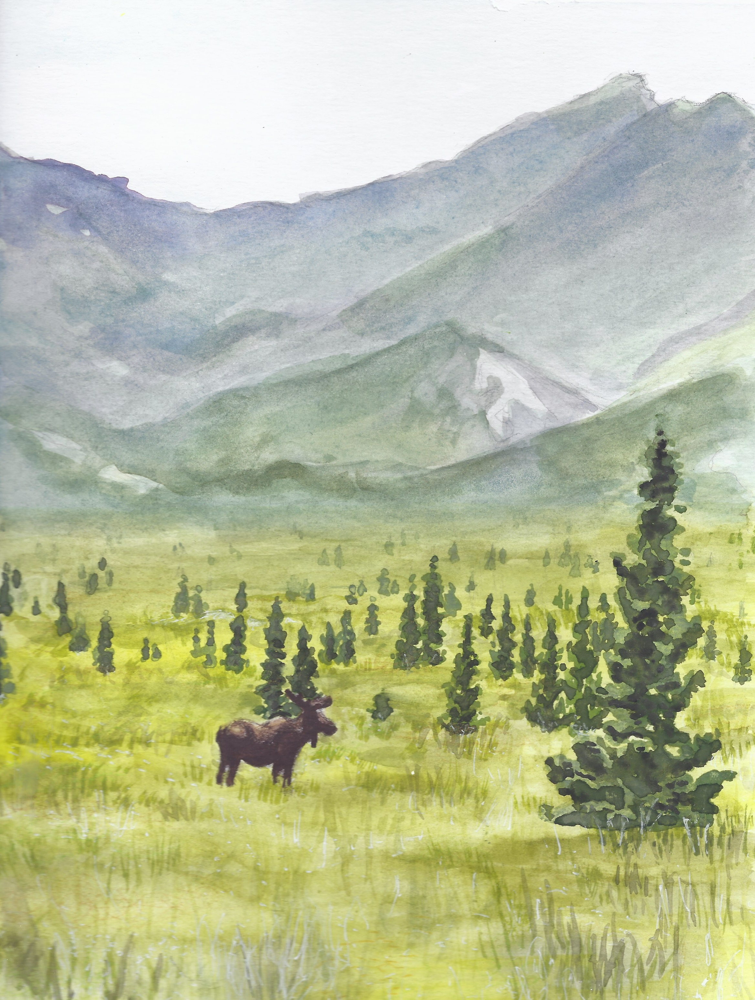
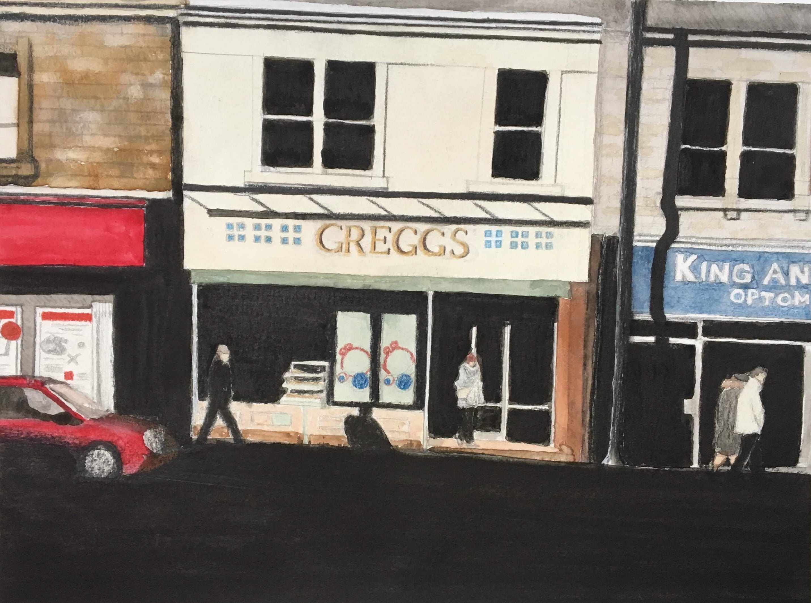

    
    

        
Denali, 8 inches x 11 inches watercolor on hot press paper

    

    
    

        
Bishops Beach, 5 inches x 7 inches watercolor on hot press paper

    

    
    

        
Halibut Cove, 8 inches x 11 inches watercolor on hot press paper

    

    
    

        
Kachemak Bay Espresso, 5 inches x 7 inches watercolor on hot press paper

    

    
    

        
Hands are for Holding, 5 inches x 7 inches watercolor on hot press paper

    

    
    

        
No Puffin, 5 inches x 7 inches watercolor on hot press paper

    

    
    

        
Whale Watching, 8 inches x 10 inches oil on canvas

    

    
    

        
Happy Anniversary, 5 inches x 7 inches watercolor on hot press paper

    

    
    

        
Greggs, 8 inches x 11 inches watercolor on hot press paper

    

    
    

        
Tiny Dancers, inches x inches watercolor on canvas

    

    
    

        
Dancing Queen, 10 inches x 10 inches acrylic on canvas

    

    
    

        
Green Door, 8 inches x 10 inches acrylic on canvas

    

    
    

        
St. Pauls Cathedral, 12 inches x 16 inches acrylic on canvas

    

    
    

        
Louisville Landscape 1, 8 inches x 10 inches oil on canvas

    

    
    

        
Whitley Bay, 8 inches x 10 inches oil on canvas

    

    
    

        
Rasin, 16 inches x 20 inches acrylic on canvas

    

    
    

        
Missy, 8 inches x 10 inches acrylic on canvas

    

    
    

        
Melo, 8 inches x 10 inches acrylic on canvas

    

    
    

        
Jamie, 8 inches x 10 inches acrylic on canvas

    

    
    

        
Jack, 8 inches x 10 inches acrylic on canvas

    

    
    

        
Tiger, 8 inches x 11 inches watercolor on hot press paper

    

    
    

        
Spring Bloom 1, 8 inches x 10 inches acrylic on canvas

    

    
    

        
Spring Bloom 2, acrylic on 2 combined 8 x 10 inch canvas boards

    

    
    

        
Spring Bloom 3, 5 inches x 7 inches acrylic on canvas

    

    
    

        
Dancing in the Rain, 8 inches x 10 inches watercolor on canvas

    

    
    

        
St. Valentine 1, 12 inches x 16 inches oil on canvas

    

    
    

        
St. Valentine 2, 5 inches x 7 inches oil on canvas

    

    
    

        
St. Valentine 3, 8 inches x 10 inches oil on canvas

    

    

  &times;
  

    

      
1

      
    

    

      
2

      
    

    

      
3

      
    

    

      
4

      
    

    

      
5

      
    

    

      
6

      
    

    

      
7

      
    

    

      
8

      
    

    

      
9

      
    

    

      
10

      
    

    

      
11

      
    

    

      
12

      
    

    

      
13

      
    

    

      
14

      
    

    

      
15

      
    

    

      
16

      
    

    

      
17

      
    

    

      
18

      
    

    

      
19

      
    

    

      
20

      
    

    

      
21

      
    

    

      
22

      
    

    

      
23

      
    

    

      
24

      
    

    

      
25

      
    

    

      
26

      
    

    

      
27

      
    

    

      
28

      
    

    <a class="prev" onclick="plusSlides(-1)">&#10094;</a>
    <a class="next" onclick="plusSlides(1)">&#10095;</a>
    <!-- 

      

    
 -->
  

